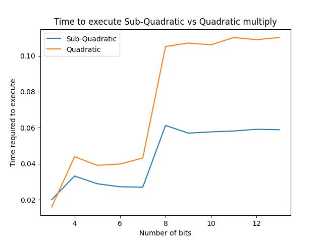

# CMPS 2200 Assignment 2

**Name:** Jack Zemke

In this assignment we'll work on applying the methods we've learned to analyze recurrences, and also see their behavior
in practice. As with previous
assignments, some of of your answers will go in `main.py` and `test_main.py`. You
should feel free to edit this file with your answers; for handwritten
work please scan your work and submit a PDF titled `assignment-02.pdf`
and push to your github repository.

1. Derive asymptotic upper bounds of work for each recurrence below.
  * $W(n)=2W(n/3)+1$
    - This recurrence is leaf dominated. For a node of size n the cost of the node is $1$ and the cost of its children is $1 * 2 = 2$ (because $a=2$ creates two recursive calls.) The depth of this recursion tree is going to be $\log_{3} n$. On each level the recursion is making two recursive calls, so the number of leaves at the base case will be $2^{\log_{3} n} = n^{\log_{3} 2} \approx n^{0.63} \in O(n)$

  * $W(n)=5W(n/4)+n$
    - Again, this recurrence is leaf dominated. For a node of size n, the cost of the node is $n$ and the cost of its children is $5\frac{n}{4} = \frac{5}{4}n$ which is greater than the cost of the root by a factor of $\frac{5}{4}$. The depth of this recursion tree is going to be $\log_{4} n$. On each level the recursion is making five recursive calls, so the number of leaves at the base case will be $5^{\log_{4} n} = n^{\log_{4} 5} \approx n^{1.16} \in O(n^2)$

  * $W(n)=7W(n/7)+n$
    - This recurrence is balanced. For a node of size of n, the cost of the node is $n$ and the cost of its children is $7\frac{n}{7} = \frac{7}{7}n = n$. The maximum cost of any level is therefore upper bounded by $n$. There are at most $\log_{7} n$ levels to the tree, so the total cost is bounded by $ O(n \log n)$

  * $W(n)=9W(n/3)+n^2$
    - For a node of size $n$, the cost is $n^2$, and cost of its children is $9 {(\frac{n}{3})}^2 = 9\frac{n^2}{9} = \frac{9}{9} n^2 = n^2$. Therefore, this recurrence is balanced. The maximum cost of any level is upper bounded by $n^2$, and there are at most $\log_{3} n$ nodes. Therefore, the total cost is bounded by $O(n^2\log n)$

  * $W(n)=8W(n/2)+n^3$
    - For a node of size $n$, the cost is $n^3$, and the cost of its children is $8 {(\frac{n}{2})}^3 = 8\frac{n^3}{8} = \frac{8}{8} n^3 = n^3$. Therefore, this recurrence is balanced. The maximum cost of any level is upper bounded by $n^3$, and there are at most $\log_{2} n$ nodes. Therefore, the total cost is bounded by $O(n^3\log n)$

  * $W(n)=49W(n/25)+n^{3/2}\log n$
    - For a node of size $n$, the cost is $n^{3/2}\log n$, and the cost of its children is $49(\frac{n}{25})^{3/2}\log\frac{n}{25} = \frac{49}{125}n^{2/3}\log(\frac{n}{25})$ which is less than the cost of the root by a factor of at least $2.55$. Therefore this recurrence is root dominated. The work of the root, $n^{3/2}\log n$ is bounded by $O(n^2\log n)$
    
  * $W(n)=W(n-1)+2$
    - This recurrence is balanced because the work only decreases by 1 for each level. The largest level is at the root and has a value of $n$. There are $n$ levels, so the recurrence solves to $O(n*n) \in O(n^2)$
  * $W(n)= W(n-1)+n^c$, with $c\geq 1$
    - This recurrence is root dominated because the work geometrically decreases with each call. The factor of the geometric decrease gets larger as $n \rightarrow 1$, because $\frac{n}{n-1}$ gets larger. The largest level is at the root and has a value of $n^c$. Thus, this recurrence is bounded by $O(n^c)$.
  * $W(n)=W(\sqrt{n})+1$
    - for a node of size $n$, the cost of the node is $1$ and the cost of its children is $\sqrt{n}$. Because $\sqrt{n} \ge 1$, this recurrence is leaf dominated. $b = \sqrt{n}$, so there are $\log_{\sqrt{n}}n = 2$ levels. The depth of this tree will always be 2, no matter the size of the input $n$. Thus, this recurrence is excecuted in constant time and therefore bounded by $O(1)$.

2. Suppose that for a given task you are choosing between the following three algorithms:

  * Algorithm $\mathcal{A}$ solves problems by dividing them into
      five subproblems of half the size, recursively solving each
      subproblem, and then combining the solutions in linear time.
    - The work of this algorithm can be modeled by the recurrence $W(n) = 5W(n/2)+n$. This recurrence is leaf dominated, as for a root node of size $n$, the cost of the root is $n$ and the cost of its children is $\frac{5}{2} n$. There will be $5^{\log_{2} n}$ leaves, so the cost is bounded by $O(n^{\log_{2} 5}) \in O(n^3)$
    
  * Algorithm $\mathcal{B}$ solves problems of size $n$ by
      recursively solving two subproblems of size $n-1$ and then
      combining the solutions in constant time.
    - The work of this algorithm can be modeled by the recurrence $W(n) = 2W(n-1) + 1$. This algorithm is leaf dominated because it creates two recursive calls and only reduces the input size by 1 for each level. The depth of the tree can be defined as $2^n$, and each node has constant work. Thus this recurrence is bounded by $O(2^n)$.
    
  * Algorithm $\mathcal{C}$ solves problems of size $n$ by dividing
      them into nine subproblems of size $n/3$, recursively solving
      each subproblem, and then combining the solutions in $O(n^2)$
      time.
     - This algorithm can be modeled by the recurrence $W(n) = 9(n/3) + n^2$. For a node of size $n$, the cost is $n^2$, and cost of its children is $9 {(\frac{n}{3})}^2 = 9\frac{n^2}{9} = \frac{9}{9} n^2 = n^2$. Therefore, this recurrence is balanced. The maximum cost of any level is upper bounded by $n^2$, and there are at most $\log_{3} n$ nodes. Therefore, the total cost is bounded by $O(n^2\log n)$

    What are the asymptotic running times of each of these algorithms?
    Which algorithm would you choose?
      - None of these algorithms are very efficient, but the most effecient is algorithm $\mathcal{C}$ with an asymptotic running time of $O(n^2\log n)$.

3. Now that you have some practice solving recurrences, let's work on
  implementing some algorithms. In lecture we discussed a divide and
  conquer algorithm for integer multiplication. This algorithm takes
  as input two $n$-bit strings $x = \langle x_L, x_R\rangle$ and
  $y=\langle y_L, y_R\rangle$ and computes the product $xy$ by using
  the fact that $xy = 2^{n/2}x_Ly_L + 2^{n/2}(x_Ly_R+x_Ry_L) +
  x_Ry_R.$ Use the
  stub functions in `main.py` to implement Karatsaba-Ofman algorithm algorithm for integer
  multiplication: a divide and conquer algorithm that runs in
  subquadratic time. Then test the empirical running times across a
  variety of inputs in `test_main.py` to test whether your code scales in the manner
  described by the asymptotic runtime. Please refer to Recitation 3 for some basic implementations, and Eqs (7) and (8) in the slides https://github.com/allan-tulane/cmps2200-slides/blob/main/module-02-recurrences/recurrences-integer-multiplication.ipynb

    - In order to compare the runtimes of sub-quadratic and quadratic multiply, I created the document `graph.py`. I used a for loop to generate integers with increasing bit values, then used the `quadratic multiply()` from recitation 3 to compare against `sub-quadratic()` from this assignment. I used the `time_multiply()` function that was partially provided in `main.py` to measure the runtimes, and implimented my own `graph()` function to cache the runtimes and plot them against the number of bits used by the integers. 
 
 

